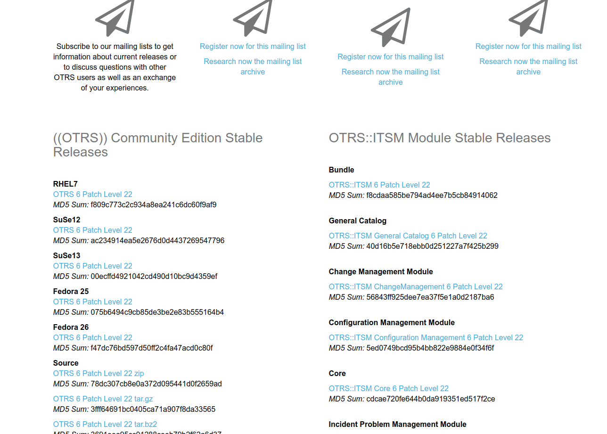

## PROJETO DE INTEGRAÇÃO DO ZABBIX COM OTRS (TICKET TOOL)

- Eu vou demonstrar o projeto usando scripts (Bash), é uma forma automatizada de instalar as aplicações. Depois será abordado o uso do Ansible para gestão de configuração nos hosts remoto, onde criarei uma playbook para promover um ambiente automatizado.

### Etapa 1 - Preparação e instalação das aplicações OTRS e Zabbix

- Utilizar o link para a instalação da aplicação de tickets: https://medium.com/@amaurybsouza/otrs6-d4abf0915de

- Utilizar o link para a instalação da aplicação de monitoramento Zabbix: https://medium.com/@amaurybsouza/instalação-do-zabbix-server-4-2-all-in-one-748622cdbf2

### Etapa 2 - Instalação de dependências no sistema

- Vamos utilizar o seguinte cenário para esse projeto:
  - CentOS 7
  - Zabbix 3.4
  - OTRS 6
  - Python 2.7
  
- Dependências a serem instaladas:
  
  - $ yum install python-pip
  - $ pip install python-otrs
  - $ pip install zabbix-api
  - $ yum install -y "perl(Crypt::SSLeay)" "perl(Date::Format)" "perl(DateTime)" "perl(IO::Socket::SSL)"            "perl(LWP::UserAgent)" "perl(Net::DNS)" "perl(Net::LDAP)" "perl(Template)" "perl(URI)" "perl(XML::LibXSLT)" perl-core procmail

### Etapa 3 - Download de pacote

- Você deve fazer o download do pacote Bundle no site do OTRS (Bundle - OTRS::ITSM 6 Patch Level 22)

  - https://community.otrs.com/download-otrs-community-edition/ ou siga a página abaixo:
  
  

### Etapa 4 - Instalação do pacote no menu de administração do OTRS

- Navegar até o gerenciador de pacotes do OTRS, e adicionar o pacote que foi baixado:

### Etapa 5 - 

